# End to End Machine Learning: From Data Collection to Deployment 🚀

## Introduction

*This started out as a challenge. With a [friend](http://marwandebbiche.com) of mine, we wanted to see if it was possible to build something from scratch and push it to production. In 3 weeks.*

In this post, we'll go through the necessary steps to build and deploy a machine learning application. This starts from data collection to deployment and the journey, as you'll see it, is exciting and fun 😀.

Before we begin, let's have a look at the app we'll be building:

<p align="center">
    
</p>

As you see, this web app allows a user to evaluate random brands by writing reviews. While writing, the user will see the sentiment score of his input updating in real-time along with a proposed rating from 1 to 5.

The user can then change the rating in case the suggested one does not reflect his views, and submit.

You can think of this as a crowd sourcing app of brand reviews with a sentiment analysis model that suggests ratings that the user can tweak and adapt afterwards.

To build this application we'll follow these steps:

- Collecting and scraping customer reviews data using Selenium and Scrapy
- Training a deep learning sentiment classifier on this data using PyTorch
- Building an interactive web app using Dash
- Setting a REST API and a Postgres database
- Dockerizing the app using Docker Compose
- Deploying to AWS 

All the code is available in our github <a href="https://github.com/MarwanDebbiche/post-tuto-deployment">repository</a> and organized in independant directories, so you can check it, run it and improve it.

Let's get started! 💻

## 1 - Scraping the data from Trustpilot with Selenium and Scrapy 🧹

**⚠️ Disclaimer: The scripts below are meant for educational purposes only: scrape responsibly.**

In order to train a sentiment classifier, we need data. We can sure download open source datasets for sentiment analysis tasks such as <a href="http://jmcauley.ucsd.edu/data/amazon/"> Amazon Polarity</a> or <a href="https://www.kaggle.com/iarunava/imdb-movie-reviews-dataset">IMDB</a> movie reviews but for the purpose of this tutorial, **we'll build our own dataset**. We'll scrape customer reviews from Trustpilot. 

Trustpilot.com is a consumer review website founded in Denmark in 2007. It hosts reviews of businesses worldwide and nearly 1 million new reviews are posted each month.


<p align="center">
  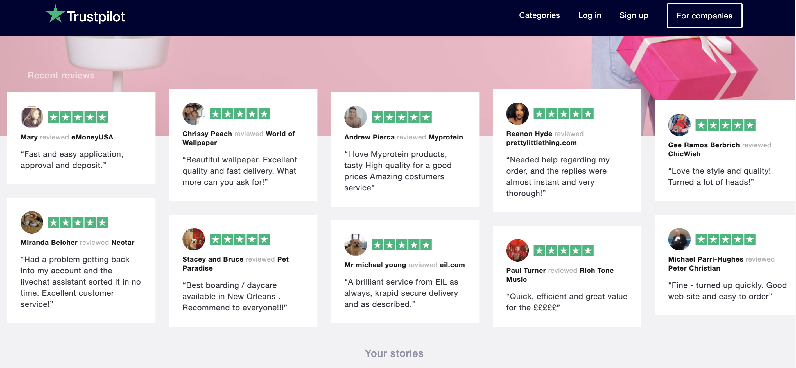
</p>


Trustpilot is an interesting source because each customer review is associated with a number of stars.

<p align="center">
  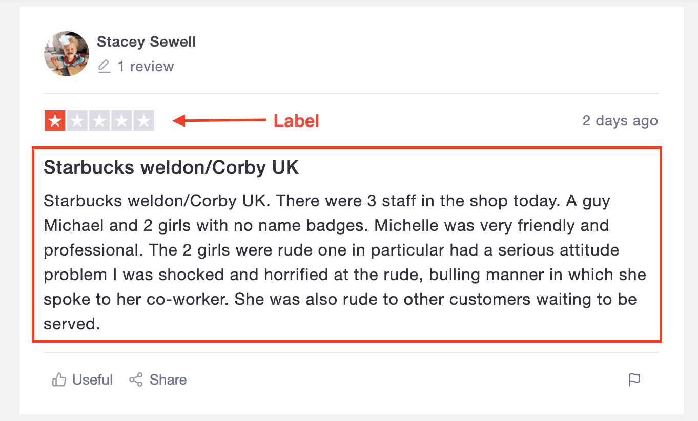
</p>

By leveraging this data, we are able to map each review to a sentiment class. 

In fact, we defined reviews with:

- 1 and 2 stars as **bad reviews** ❌
- 3 stars as **average reviews** ⚠️
- 4 and 5 stars as **good reviews** ✅


In order to scrape customer reviews from trustpilot, we first have to understand the structure of the website. 

Trustpilot is organized by categories of businesses.

<p align="center">
  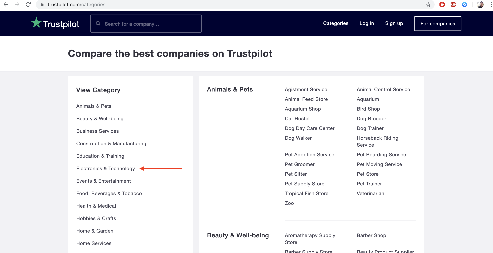
</p>

Each category is divided into sub-categories.

<p align="center">
  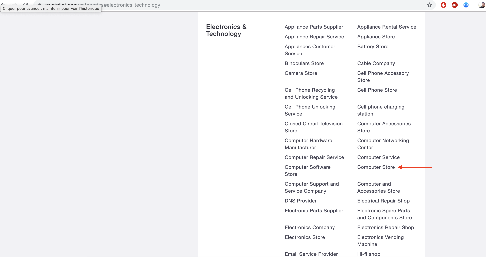
</p>

Each sub-category is divided into companies.

<p align="center">
  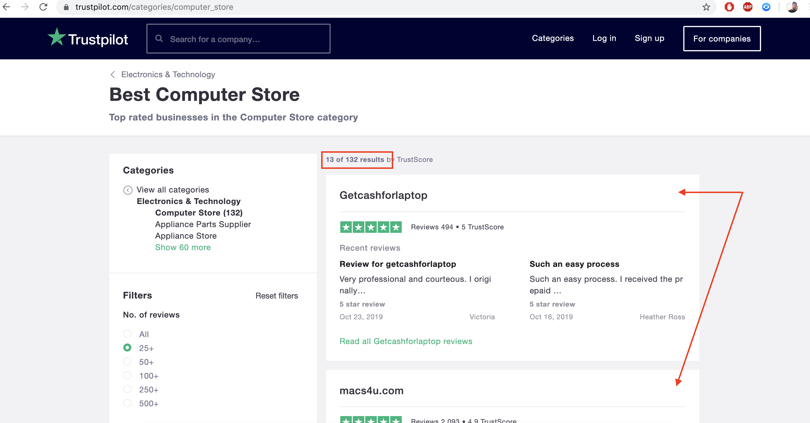
</p>

And then each company has its own set of reviews, usually spread over many pages.

<p align="center">
  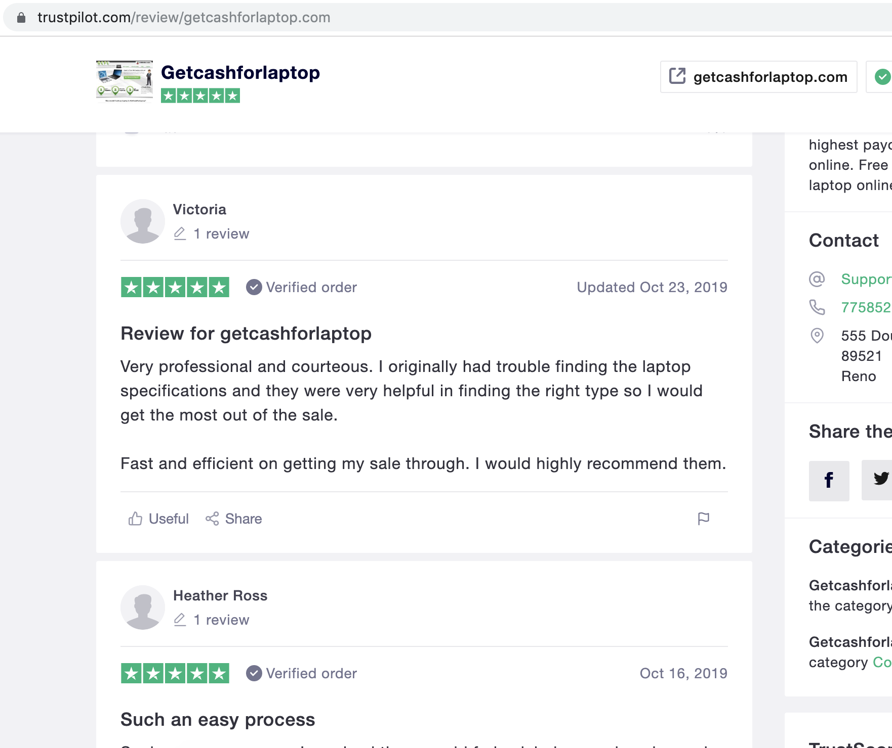
</p>

As you see, this is a top down tree structure. In order to scrape the reviews out of it, we'll proceed in two steps.

- Step 1️⃣: use Selenium to fetch each company page url

- Step 2️⃣: use Scrapy to extract reviews from each company page

### Scrape company urls with Selenium: step 1️⃣ 

<i>All the Selenium code is available and runnable from this <a href="https://github.com/MarwanDebbiche/post-tuto-deployment/blob/master/src/scraping/selenium/scrape_website_urls.ipynb">notebook</a></i> 📓

We first use Selenium because the content of the website that renders the urls of each company is dynamic  which means that it cannot be directly accessed from the page source. It's rather rendered on the front end of the website through Ajax calls.

Selenium does a good job extracting this type of data: it simulates a browser that interprets javascript rendered content. When launched, it clicks on each category, narrows down to each sub-category and goes through all the companies one by one and extracts their urls. When it's done, the script saves these urls to a csv file.

Let's see how this is done:

We'll first import Selenium dependencies along with other utility packages.

```python
import json
import time

from bs4 import BeautifulSoup
import requests
import pandas as pd

from selenium import webdriver
from selenium.common.exceptions import NoSuchElementException
from selenium.common.exceptions import TimeoutException
from selenium.webdriver.support.ui import WebDriverWait
from selenium.webdriver.support import expected_conditions as EC
from selenium.webdriver.common.by import By
from selenium.webdriver.chrome.options import Options

from tqdm import tqdm_notebook

base_url = "https://trustpilot.com"


def get_soup(url):
    return BeautifulSoup(requests.get(url).content, 'lxml')
```

We start by fetching the sub-category URLs nested inside each category.

If you open up your browser and inspect the source code, you'll find out 22 category blocks (on the right) located in `div` objects that have a `class` attribute equal to  `category-object`

<p align="center">
    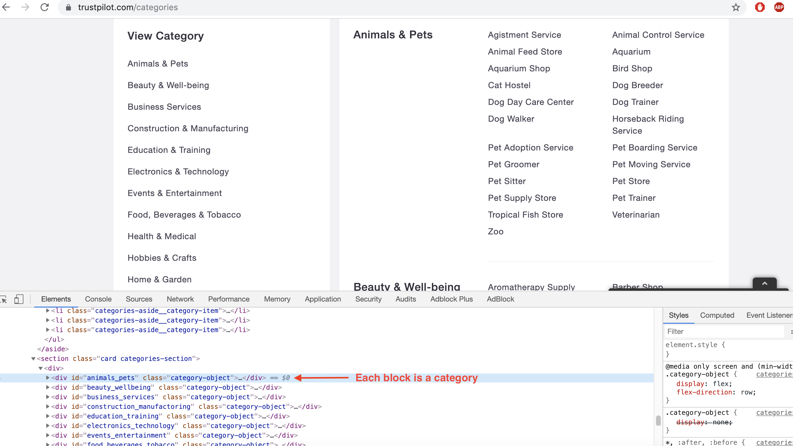
</p>

Each category has its own set of sub-categories. Those are located in `div` objects that have `class` attributes equal to `child-category`. We are interested in finding the urls of these subcategories.
<p align="center">
    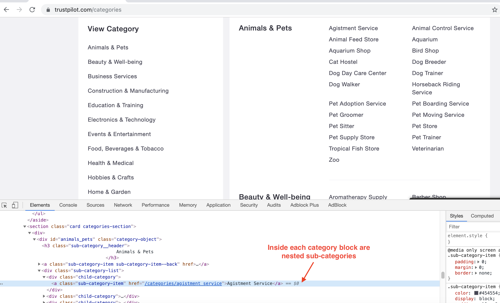
</p>


Let's first loop over categories and for each one of them collect the URLs of the sub-categories. This can be achieved using Beautifulsoup and requests.

```python
data = {}

soup = get_soup(base_url + '/categories')
for category in soup.findAll('div', {'class': 'category-object'}):
    name = category.find('h3', {'class': 'sub-category__header'}).text
    name = name.strip()
    data[name] = {}  
    sub_categories = category.find('div', {'class': 'sub-category-list'})
    for sub_category in sub_categories.findAll('div', {'class': 'child-category'}):
        sub_category_name = sub_category.find('a', {'class': 'sub-category-item'}).text 
        sub_category_uri = sub_category.find('a', {'class': 'sub-category-item'})['href'] 
        data[name][sub_category_name] = sub_category_uri
```

Now comes the selenium part: we'll need to loop over the companies of each sub-category and fetch their URLs. 

Remember, companies are presented inside each sub-category like this:

<p align="center">
    
</p>

We first define a function to fetch company urls of a given subcategory:

```python
def extract_company_urls_form_page():
    a_list = driver.find_elements_by_xpath('//a[@class="category-business-card card"]')
    urls = [a.get_attribute('href') for a in a_list]
    dedup_urls = list(set(urls))
    return dedup_urls
```

and another function to check if a next page button exists:

```python
def go_next_page():
    try:
        button = driver.find_element_by_xpath('//a[@class="button button--primary next-page"]')
        return True, button
    except NoSuchElementException:
        return False, None
```

Now we initialize Selenium with a headless Chromedriver. This prevents Selenium from opening up a Chrome window thus accelerating the scraping.

PS: You'll have to donwload Chromedriver from this <a href="https://chromedriver.chromium.org/">link</a> and choose the one that matches your operatig system. It's basically a binary of a Chrome browser that Selenium uses to start.

```python
options = Options()
options.add_argument('--headless')
options.add_argument('--no-sandbox')
options.add_argument('start-maximized')
options.add_argument('disable-infobars')
options.add_argument("--disable-extensions")

prefs = {"profile.managed_default_content_settings.images": 2}
options.add_experimental_option("prefs", prefs)

driver = webdriver.Chrome('./driver/chromedriver', options=options)

timeout = 3
```
The timeout variable is the time (in seconds) Selenium waits for a page to completely load.

Now we launch the scraping. This approximatively takes 50 minutes with good internet connexion.

```python
company_urls = {}
for category in tqdm_notebook(data):
    for sub_category in tqdm_notebook(data[category], leave=False):
        company_urls[sub_category] = []

        url = base_url + data[category][sub_category] + "?numberofreviews=0&timeperiod=0&status=all"
        driver.get(url)
        try: 
            element_present = EC.presence_of_element_located(
                (By.CLASS_NAME, 'category-business-card card'))
            
            WebDriverWait(driver, timeout).until(element_present)
        except:
            pass
    
        next_page = True
        c = 1
        while next_page:
            extracted_company_urls = extract_company_urls_form_page()
            company_urls[sub_category] += extracted_company_urls
            next_page, button = go_next_page()
            
            if next_page:
                c += 1
                next_url = base_url + data[category][sub_category] + "?numberofreviews=0&timeperiod=0&status=all" + f'&page={c}'
                driver.get(next_url)
                try: 
                    element_present = EC.presence_of_element_located(
                        (By.CLASS_NAME, 'category-business-card card'))
                    
                    WebDriverWait(driver, timeout).until(element_present)
                except:
                    pass
```

Once the scraping is over, we save the company urls to a csv file.

```python
consolidated_data = []

for category in data:
    for sub_category in data[category]:
        for url in company_urls[sub_category]:
            consolidated_data.append((category, sub_category, url))

df_consolidated_data = pd.DataFrame(consolidated_data, columns=['category', 'sub_category', 'company_url'])

df_consolidated_data.to_csv('./exports/consolidate_company_urls.csv', index=False)
```

And here's what the data looks like:

<p align="center">
    
</p>

Pretty neat right? Now we'll have to go through the reviews listed in each one of those urls.

### Scrape customer reviews with Scrapy: step 2️⃣ 

<i>All the scrapy code can be found in this <a href="https://github.com/MarwanDebbiche/post-tuto-deployment/tree/master/src/scraping/scrapy">folder</a></i> 📁

Ok, now we're ready to use Scrapy.

First, you need to install it either using:

- conda: `conda install -c conda-forge scrapy` 

or 

- pip: `pip install scrapy`

Then, you'll need to start a project:

```bash
cd src/scraping/scrapy
scrapy startproject trustpilot
```

This command creates the structure of a Scrapy project. Here's what it looks like:

```python
scrapy/
    scrapy.cfg            # deploy configuration file

    trustpilot/             # project's Python module, you'll import your code from here
        __init__.py

        items.py          # project items definition file

        middlewares.py    # project middlewares file

        pipelines.py      # project pipelines file

        settings.py       # project settings file

        spiders/          # a directory where you'll later put your spiders
            __init__.py
```

Using Scrapy for the first time can be overwhelming, so to learn more about it, you can visit the official <a href="http://doc.scrapy.org/en/latest/intro/tutorial.html">tutorials</a>.

To build our scraper, we'll have to create a spider inside the `spiders` folder. We'll call it `scraper.py` and change some parameters in `settings.py`. We won't change the other files.

What the scraper will do is the following:

- It starts from a company url
- It goes through each customer review and yields a dictionary of data containing the following items

    - comment: the text review
    - rating: the number of stars (1 to 5)
    - url_website: the company url on trustpilot 
    - company_name: the company name being reviewed
    - company_website: the website of the company being reviewed
    - company_logo: the url of logo of the company being reviewed 
- It moves to the next page if any

Here's the full script.

To fully understand it, you should inspect the source code. It's really easy to get. 

In any case, if you have a question don't hesitate to post it in the comment section ⬇

```python
import re
import pandas as pd
import scrapy

class Pages(scrapy.Spider):
    name = "trustpilot"

    company_data = pd.read_csv('../selenium/exports/consolidate_company_urls.csv')
    start_urls = company_data['company_url'].unique().tolist()

    def parse(self, response):
        company_logo = response.xpath('//img[@class="business-unit-profile-summary__image"]/@src').extract_first()
        company_website = response.xpath("//a[@class='badge-card__section badge-card__section--hoverable']/@href").extract_first()
        company_name = response.xpath("//span[@class='multi-size-header__big']/text()").extract_first()
        comments = response.xpath("//p[@class='review-content__text']")
        comments = [comment.xpath('.//text()').extract() for comment in comments]
        comments = [[c.strip() for c in comment_list] for comment_list in comments]
        comments = [' '.join(comment_list) for comment_list in comments]

        ratings = response.xpath("//div[@class='star-rating star-rating--medium']//img/@alt").extract()
        ratings = [int(re.match('\d+', rating).group(0)) for rating in ratings]

        for comment, rating in zip(comments, ratings):
            yield {
                'comment': comment,
                'rating': rating,
                'url_website': response.url,
                'company_name': company_name,
                'company_website': company_website,
                'company_logo': company_logo
            }

        next_page = response.css('a[data-page-number=next-page] ::attr(href)').extract_first()
        if next_page is not None:
            request = response.follow(next_page, callback=self.parse)
            yield request

```

Before launching the scraper, you have to change a couple of things in the settings.py:

Here are the changes we made:

```python
# Obey robots.txt rules
ROBOTSTXT_OBEY = False

# Configure maximum concurrent requests performed by Scrapy (default: 16)
CONCURRENT_REQUESTS = 32

#Export to csv
FEED_FORMAT = "csv"
FEED_URI = "comments_trustpilot_en.csv"
```
This indicates to the scraper to ignore robots.txt, to use 32 concurrent requests and to export the data into a csv format under the filename: `comments_trustpilot_en.csv`.

Now time to launch the scraper: 

```bash 
cd src/scraping/scrapy
scrapy crawl trustpilot
```

We'll let it run for a little bit of time.

Note that we can interrupt it at any moment since it saves the data on the fly on this output folder is ```src/scraping/scrapy```.

## 2 - Training a sentiment classifer usig PyTorch 🤖

*The code and the model we'll be using here are inspired from this github <a href="https://github.com/ahmedbesbes/character-based-cnn">repo</a> so go check it for additional information. If you want to stick to this project's repo you can look at this <a href="https://github.com/MarwanDebbiche/post-tuto-deployment/tree/master/src/training">link</a>*.

Now that the data is collected, we're ready to train a sentiment classifier to predict the labels we defined earlier.

There are a wide range of possible models to use. The one we'll be training is a character based convolutional neural network. It's based on this <a href="https://arxiv.org/pdf/1509.01626.pdf">paper</a> and it proved to be really good on text classification tasks such as binary classification of Amazon Reviews datasets.

The question you'd be asking up-front though is the following: how would you use CNNs for text classification? Aren't these architectures specifically designed for image data?

Well, the truth is, CNN are way more versatile and their application can extend the scope of image classification. In fact, they are also able to capture sequential information that is inherent to text data. The only trick here is to efficiently represent the input text.

To see how this is done, imagine the following tweet:

<p align="center">
    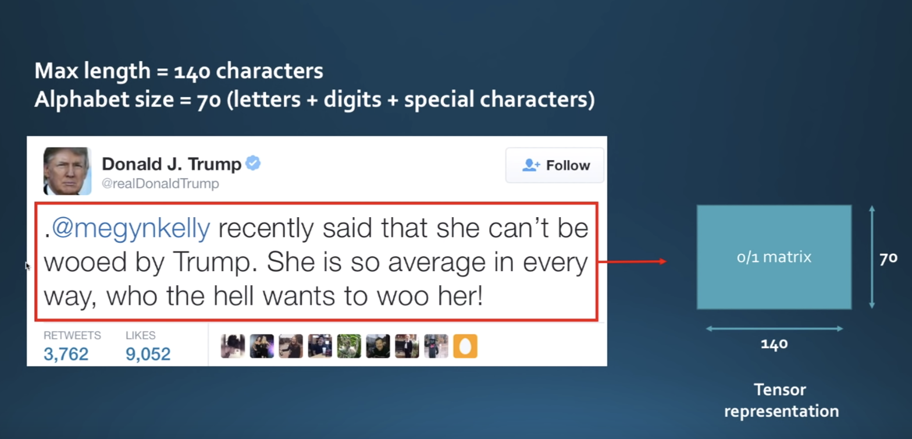
</p>

Assuming an alphabet of size 70 containing the english letters and the special characters and an arbitrary maximum length of 140, one possible representation of this sentence is a (70, 140) matrix where each column is a one hot vector indicating the position of a given character in the alphabet and 140 being the maximum length of tweets. This process is called **quantization**.

Note that if a sentence is too long, the representation truncates up to the first 140 characters. On the other hand, if the sentence is too short 0 column vectors are padded until the (70, 140) shape is reached.

So what to do now with this representation?

<p align="center">
    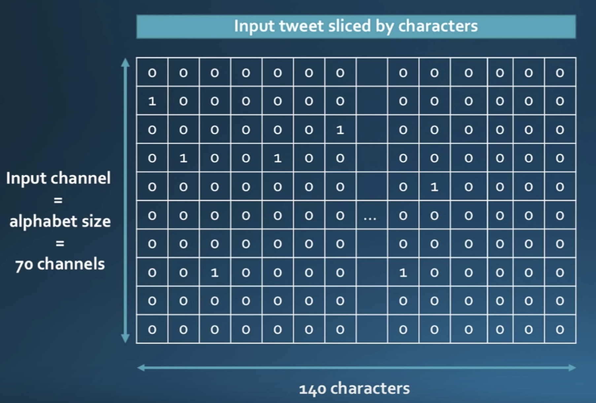
</p>

**Feed it to a CNN for classification, obviously 😁**

But there's a small trick though. Convolutions are usually performed using 2D-shaped kernels, because these structures capture the 2D spatial information lying in the pixels. 
Text is however not suited to this type of convolutions because letters follow each other sequentially, in one dimension only, to form a meaning. To capture this 1-dimensional dependency, we'll use **1D convolutions**.

**So how does a 1-D convolution work?**

Unlike 2D-convolutions that make a 2D kernel slide horizontally and vertically over the pixels, 1D-convolutions use 1D kernels that slide horizontally only over the columns (i.e. the characters) to capture the dependency between characters and their compositions. You could think for example about a 1D kernel of size 3 as a character 3-gram detector that fires when it detects a composition of three sucessive letters that is relevant to the prediction.

The diagram below shows the architecture we'll be using: 

<p align="center">
    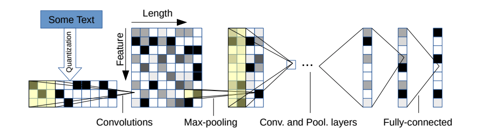
</p>

It has 6 convolutional layers:

|Layer|Number of Kernels|Kernel size|Pool|
|-|-|-|-|
|1|256|7|3|
|2|256|7|3|
|3|256|3|N/A|
|4|256|3|N/A|
|5|256|3|N/A|
|6|256|3|3|

and 2 fully connected layers:

|Layer|Number of neurons|
|-|-|
|7|1024|
|8|1024|
|9|3|

On the raw data, i.e. the matrix representation of a sentence, convolutions with a kernel of size 7 are applied. Then the output of this layer is fed to a second convolution layer with a kernel of size 7 as well, etc, until the last conv layer that has a kernel of size 3.

After the last convolution layer, the output is flattened and passed through two successive fully connected layers that act as a classifier.

To learn more about character level CNN and how they work, you can watch this video:

<p align="center">
    <iframe width="600" height="400" src="https://www.youtube.com/embed/CNY8VjJt-iQ" frameborder="0" allow="accelerometer; autoplay; encrypted-media; gyroscope; picture-in-picture" allowfullscreen  style="margin:15px"></iframe>
</p>

Character CNN are interesting for various reasons since they have nice properties 💡

- They are quite powerful in text classification (see paper's benchmark) even though they don't have any notion of semantics
- You don't need to apply any text preprocessing (tokenization, lemmatization, stemming ...) while using them
- They handle misspelled words and OOV (out-of-vocabulary) tokens
- They are faster to train compared to recurrent neural networks
- They are lightweight since they don't require storing a large word embedding matrix. Hence, you can deploy them in production easily


That's all about the theory now !

### How to train the model using PyTorch  🔥

In order to train a character level cnn, you'll find all the files you need under the `src/training/` folder.

Here's the structure of the code inside this folder:
- `train.py`: used for training a model
- `predict.py`: used for the testing and inference
- src: a folder that contains:
    - `model.py`: the actual CNN model (model initialization and forward method
    - `dataloader.py`: the script responsible of passing the data to the training after processing 
    - `utils.py`: a set of utility functions for text preprocessing (url/hashtag/user_mention removal)


To train our classifier, run the following commands:

```bash

cd src/training/

python train.py --data_path ./data/tp_amazon.csv \ 
                --validation_split 0.1 \
                --label_column rating \
                --text_column comment \
                --max_length 1014 \
                --dropout_input 0 \
                --group_labels 1  \
                --balance 1 \
                --ignore_center 0 \
                --model_name en_trustpilot \
                --log_every 250
```

When it's done, you can find the trained models in ```src/training/models``` directory.

#### Model performance 🎯

**On training set**

On the training set we report the following metrics for the best model (epoch 5):

<p align="center">
    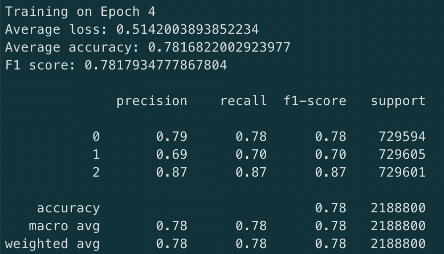
</p>

Here's the corresponding tensorboard training logs:

<p align="center">
    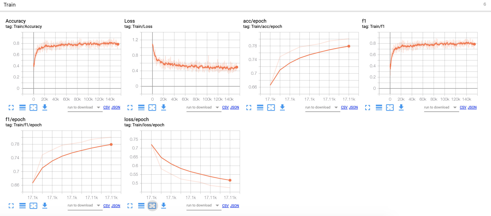
</p>

**On validation set**

On the validation set we report the following metrics for the best model (epoch 5):

<p align="center">
    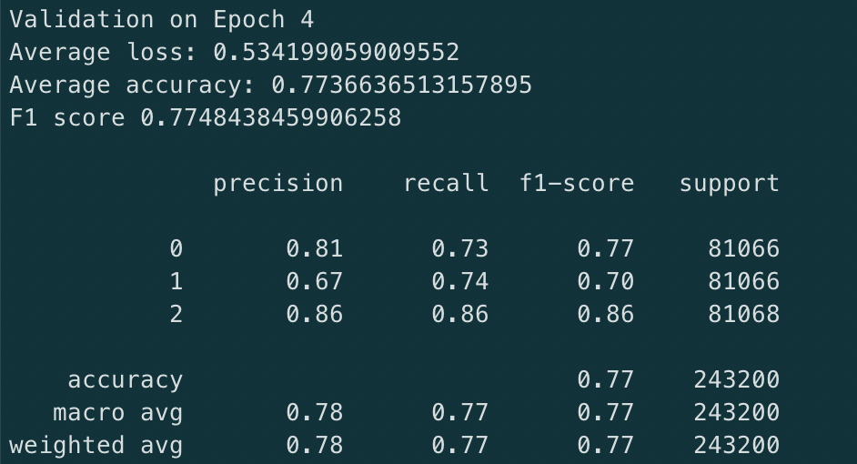
</p>

Here's the corresponding validation tensorboard logs:

<p align="center">
    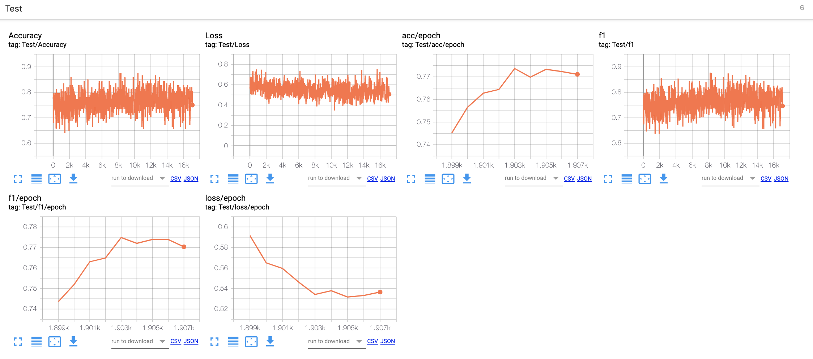
</p>

<hr>

Few remarks according to these figures:

- The model is learning and correctly converging as we see it in the decreasing losses
- The model is very good at identifying good and bad reviews. It has a slightly lower performance on average reviews though. This can be explained by the core nature of these reviews. They are more nuanced in general and easily, even for a human, mis-interpreted as bad or good reviews.
- A three class classification problem is more difficult than a binary one. In fact, if you focus on a binary classification problem, you can reach 95% accuracy. Nevertheless, training a 3 class classifier has the advantage of identifying mitigated reviews which can be interesting.

To learn more about the training arguments and options, please check out the original <a href="https://github.com/ahmedbesbes/character-based-cnn">repo</a>.

From now on, we'll use the trained model that is saved as a release <a href="https://github.com/ahmedbesbes/character-based-cnn/releases/download/model_en_tp_amazon/model_tp_amazon_1014.pth">here</a>. When running the app for the first time, it'll get downloaded from that link and locally saved (in the container) for the inference.

## 3 - Building an interactive web app 📲 with Dash, Flask and PostgreSQL

*The dash code can be found [here](https://github.com/MarwanDebbiche/post-tuto-deployment/tree/master/src/dash) and the api code [here](https://github.com/MarwanDebbiche/post-tuto-deployment/tree/master/src/api)*

Now that we have trained the sentiment classifier, let's build our application so that end-users can interact with the model and evaluate new brands.

Here is a schema of our app architecture:


<p align="center">
    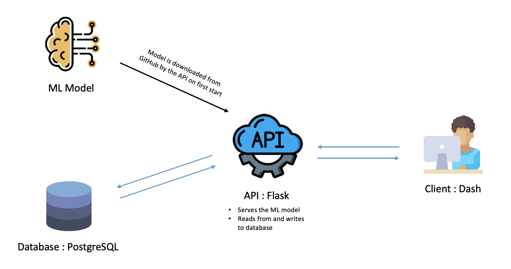
</p>

As you can see, there are four building blocks in our app:
- A visualization application built using [Dash](https://dash.plot.ly/).
- A [Flask](https://flask.palletsprojects.com/en/1.1.x/) REST API.
- A [PostgreSQL](https://www.postgresql.org/) database
- Our trained Machine Learning [model](https://github.com/ahmedbesbes/character-based-cnn/releases/download/english/model_en.pth).

The Dash app will make http requests to the Flask API, wich will in turn interact with either the PostgreSQL database by writing or reading records to it, or the ML model by serving it for real-time inference.

If you are already familiar with Dash, you know that it is built on top of Flask. So we could basically get rid of the API and put everything within the dash code.

We chose not to for a very simple reason: **it makes the logic and the visualization parts independant**. Indeed, because we have a separated API, we can with very little effort replace the Dash app with any other frontend technology, or add a mobile or desktop app.

Now, let's have a closer look at how those blocks are built. 

### PostgreSQL Database

Nothing fancy or original regarding the database part. We chose to use one of the most widely used relational databases: PostgreSQL.

To run a PostgreSQL database for local development, you can either download PostgreSQL from the [official website](https://www.postgresql.org/download/) or, more simply, launch a postgres container using [Docker](https://hub.docker.com/_/postgres):

```
docker pull postgres
docker run --name postgres -e POSTGRES_USER=postgres -e POSTGRES_PASSWORD=password -e POSTGRES_DB=postgres -p 5432:5432 -d postgres
```
If you are not familiar with docker yet, don't worry, we'll talk about it very soon.

The two following commands allow to:
- pull a [postgres docker image](https://hub.docker.com/_/postgres)  from Docker Hub
- run this image in a container

### Flask API

The RESTful API is the most important part of our app. It is responsible for the interactions with both the machine learning model and the database.

Let's have a look at the routes needed for our api:

- Sentiment Classification: `POST /api/predict`
- Create review: `POST /api/review`
- Get reviews: `GET /api/predicts`

**Sentiment Classification Route**

`POST /api/predict`

This route used to predict the sentiment based on the review's text.

Body:
```JSON
{
    "review": "I hate this brand..."
}
```

Response:
```JSON
0.123
```


As you can see, this route gets a text field called `review` and returns a sentiment score based on that text.

It starts by downloading the trained model from github and saving it to disk. Then it loads it and pass it to GPU or CPU.

When the api receives an input review it passes it to the `predict_sentiment` function. This function is responsible of representing the raw text in a matrix format and feeding it to the model.
 
```python
from ml.model import CharacterLevelCNN
from ml.utils import predict_sentiment

model_name = 'model_en.pth'
model_path = f'./ml/models/{model_name}'
model = CharacterLevelCNN()

# download the trained PyTorch model from Github
# and save it at src/api/ml/models/
# this is done at the first run of the API

if model_name not in os.listdir('./ml/models/'):
    print(f'downloading the trained model {model_name}')
    wget.download(
        "https://github.com/ahmedbesbes/character-based-cnn/releases/download/english/model_en.pth",
        out=model_path
    )
else:
    print('model already saved to api/ml/models')

#####

# load the model
# pass it to GPU / CPU

if torch.cuda.is_available():
    trained_weights = torch.load(model_path)
else:
    trained_weights = torch.load(model_path, map_location='cpu')
model.load_state_dict(trained_weights)
model.eval()
print('PyTorch model loaded !')

#####

@api.route('/predict', methods=['POST'])
def predict_rating():
    '''
    Endpoint to predict the rating using the
    review's text data.
    '''
    if request.method == 'POST':
        if 'review' not in request.form:
            return jsonify({'error': 'no review in body'}), 400
        else:
            parameters = model.get_model_parameters()
            review = request.form['review']
            output = predict_sentiment(model, review, **parameters)
            return jsonify(float(output))
```

**Create Review**

`POST /api/review`

This route is used to save a review to the database (with associated ratings and user information).

Body:
```JSON
{
    "review": "I hate this brand...",
    "rating": 2,
    "suggested_rating": 1,
    "sentiment_score": 0.123,
    "brand": "Apple",
    "user_agent": "Mozilla/...",
    "ip_address": "127.0.0.1"
}
```

Response:
```JSON
{
  "id": 123,
  "review": "I hate this brand...",
  "rating": 2,
  "suggested_rating": 1,
  "sentiment_score": 0.123,
  "brand": "Apple",
  "user_agent": "Mozilla/...",
  "ip_address": "127.0.0.1"
}
```

In order to interact with the database, we will use the Object Relational Mapping (ORM) [peewee](http://docs.peewee-orm.com/en/latest/). It lets us define the database tables using python objects, and takes care of connecting to the database and querying it.

This is done in the `src/api/db.py` file:

```python
import peewee as pw
import config

db = pw.PostgresqlDatabase(
    config.POSTGRES_DB,
    user=config.POSTGRES_USER, 
    password=config.POSTGRES_PASSWORD,
    host=config.POSTGRES_HOST, 
    port=config.POSTGRES_PORT
)

class BaseModel(pw.Model):
    class Meta:
        database = db

# Table Description
class Review(BaseModel):

    review = pw.TextField()
    rating = pw.IntegerField()
    suggested_rating = pw.IntegerField()
    sentiment_score = pw.FloatField()
    brand = pw.TextField()
    user_agent = pw.TextField()
    ip_address = pw.TextField()

    def serialize(self):
        data = {
            'id': self.id,
            'review': self.review,
            'rating': int(self.rating),
            'suggested_rating': int(self.suggested_rating),
            'sentiment_score': float(self.sentiment_score),
            'brand': self.brand,
            'user_agent': self.user_agent,
            'ip_address': self.ip_address
        }

        return data

# Connection and table creation
db.connect()
db.create_tables([Review])
```

Having done all this using peewee makes it super easy to define the api routes to save and get reviews:

```python
import db

@api.route('/review', methods=['POST'])
def post_review():
    '''
    Save review to database.
    '''
    if request.method == 'POST':
        expected_fields = [
            'review',
            'rating',
            'suggested_rating',
            'sentiment_score',
            'brand',
            'user_agent',
            'ip_address'
        ]
        if any(field not in request.form for field in expected_fields):
            return jsonify({'error': 'Missing field in body'}), 400

        query = db.Review.create(**request.form)
        return jsonify(query.serialize())
```

**Get Reviews**

`GET /api/reviews`

This route is used to get reviews from database.

Response:
```JSON
[
    {
    "id": 123,
    "review": "I hate this brand...",
    "rating": 2,
    "suggested_rating": 1,
    "sentiment_score": 0.123,
    "brand": "Apple",
    "user_agent": "Mozilla/...",
    "ip_address": "127.0.0.1"
    }
]
```

Similarly to what we have done for the route `POST /api/review`, we use peewee to query the database. This makes the route's code quite simple:

```python
@api.route('/reviews', methods=['GET'])
def get_reviews():
    '''
    Get all reviews.
    '''
    if request.method == 'GET':
        query = db.Review.select()
        return jsonify([r.serialize() for r in query])
```

### Dash front-end

Dash is a visualization library that allows you to write html elements such divs, paragraphs and headers in a python syntax that get later rendered into React components.
This allows a great freedom to those who want to quickly craft a little web app but don't have front-end expertise.

Dash is easy to grasp. Here's a small hello world example:

```python

# -*- coding: utf-8 -*-
import dash
import dash_core_components as dcc
import dash_html_components as html

external_stylesheets = ['https://codepen.io/chriddyp/pen/bWLwgP.css']

app = dash.Dash(__name__, external_stylesheets=external_stylesheets)

app.layout = html.Div(children=[
    html.H1(children='Hello Dash'),

    html.Div(children='''
        Dash: A web application framework for Python.
    '''),

    dcc.Graph(
        id='example-graph',
        figure={
            'data': [
                {'x': [1, 2, 3], 'y': [4, 1, 2], 'type': 'bar', 'name': 'SF'},
                {'x': [1, 2, 3], 'y': [2, 4, 5], 'type': 'bar', 'name': u'Montréal'},
            ],
            'layout': {
                'title': 'Dash Data Visualization'
            }
        }
    )
])

if __name__ == '__main__':
    app.run_server(debug=True)
```

As you see, components are imported from `dash_core_components` and `dash_html_components` and inserted into lists and dictionaries, then affected to the `layout` attribute of the dash `app`.
If you're experienced with Flask, you'll notice some similarities here. If fact, Dash is build on top of Flask.

Here's what the app looks like in the browser when you visit: localhost:8050

<p align="center">
    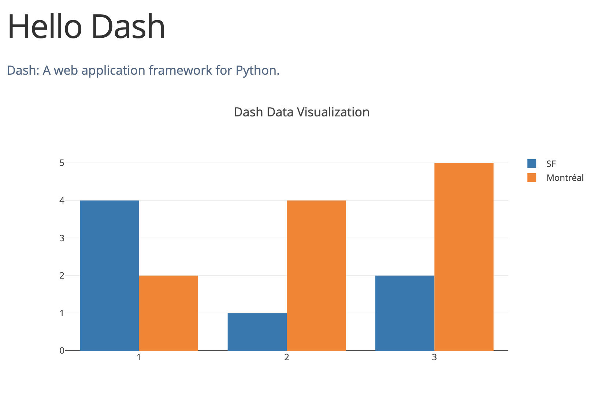
</p>

Pretty neat right?

Dash allows you to add many other UI components very easily such as buttons, sliders, multi selectors etc. You can learn more about [dash-core-components](https://dash.plot.ly/dash-core-components) and [dash-html-components](https://dash.plot.ly/dash-html-components) from the official documentation.

In our app, we also used [dash bootstrap components](https://dash-bootstrap-components.opensource.faculty.ai/l/) to make the UI mobile responsive.

#### Callbacks

To make these components interact with each other, dash introduced the concept of `callback`. Callbacks are functions that get called to affect the appearance of an html element (the **Output**) everytime the value of another element (the **Input**) changes.
Imagine the following situation: you have an html input field of id="A" and you want when everytime it gets an input to copy it inside a paragraph element of id="B", dynamically, without reloading the page. 

Here's how you'd do it with a callback:

```python
from dash.dependencies import Input, Output

@app.callback(
    [
        Output('A', 'value'),
    ],
    [
        Input('B', 'value')
    ]
)
def copie_from_A_to_B(A_input):
    B_input = A_input
    return B_input
```
This callback listens to any change of input value inside the element of id A to affect it to the input value of the element of id B. This is done, again, dynamically.

Now I'll let you imagine what you can do with callbacks when you can handle many inputs to outputs and interact with other attributes than `value`.
You can learn more about callbacks [here](https://dash.plot.ly/getting-started-part-2) or [here](https://www.youtube.com/watch?v=o5fgj1AIq4s).

<hr/>

Now back to our app !

Here's what it looks like. Each red arrow indicates the id of each html element.

<p align="center">
    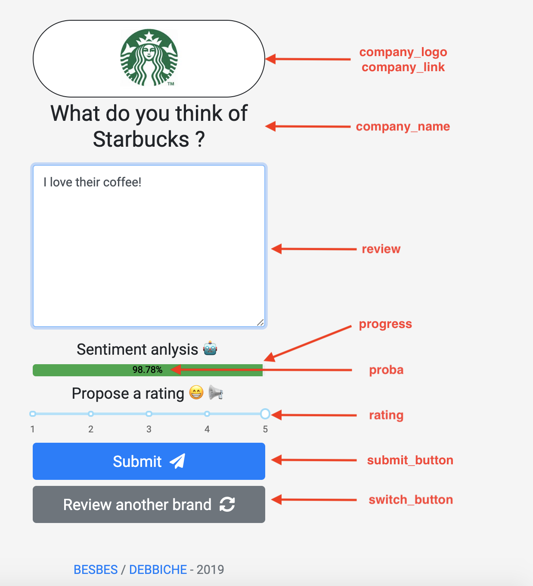
</p>

These elements obviously interact between each other. To materialize this, we defined two callback functions which can be visualized in the following graph.

<p align="center">
    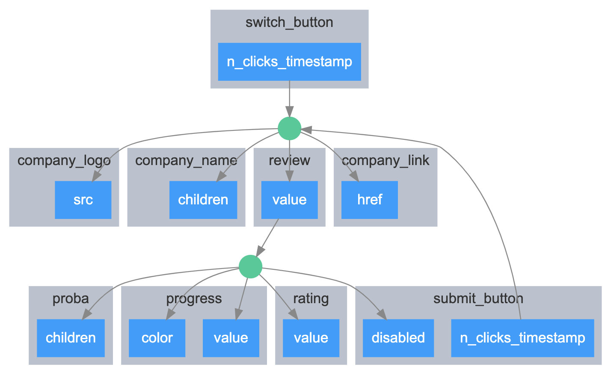
</p>


**Callback 1**

At every change of the input value of the text area of id `review`, the whole text review is sent through an http post request to the api route `POST /api/predict/` to receive a sentiment score.
Then this score is used by the callback to update the value (in percentage) inside the progress bar (proba), the length and the color of the progress bar again, the rating from 1 to 5 on the slider, as well as the state of the submit button (which is disabled by default when no text is present inside the text area.)
What you'll have out of all this is a dynamic progress bar that fluctuates (with a color code) at every change of input as well as a suggested rating from 1 to 5 that follows the progress bar.

Here's how you'd do it in code:

```python
@app.callback(
    [
        Output('proba', 'children'),
        Output('progress', 'value'),
        Output('progress', 'color'),
        Output('rating', 'value'),
        Output('submit_button', 'disabled')
    ],
    [Input('review', 'value')]
)
def update_proba(review):
    if review is not None and review.strip() != '':
        response = requests.post(
            f"{config.API_URL}/predict", data={'review': review})
        proba = response.json()
        proba = round(proba * 100, 2)
        suggested_rating = min(int((proba / 100) * 5 + 1), 5)
        text_proba = f"{proba}%"

        if proba >= 67:
            return text_proba, proba, 'success', suggested_rating, False
        elif 33 < proba < 67:
            return text_proba, proba, 'warning', suggested_rating, False
        elif proba <= 33:
            return text_proba, proba, 'danger', suggested_rating, False
    else:
        return None, 0, None, 0, True
```

**Callback 2**

This callback does two things. 

1. When the `submit_button` is clicked, it inserts a row in the database (through the api). The row contains the current data of the brand being reviewed (brand name, review, sentiment, etc) as well as the user agent and the user ip.
Then it randomly changes the brand by switching the name, the logo and the url, and resetting the review textarea.

2. You can also change the brand without submitting the review to the database, by clicking on the `switch_button` instead.


Here's the code:

```python
@app.callback(
    [
        Output('company_logo', 'src'),
        Output('company_name', 'children'),
        Output('review', 'value'),
        Output('company_link', 'href')
    ],
    [
        Input('submit_button', 'n_clicks_timestamp'),
        Input('switch_button', 'n_clicks_timestamp')
    ],
    [
        State('review', 'value'),
        State('progress', 'value'),
        State('rating', 'value'),
        State('company_name', 'children')
    ]
)
def change_brand(submit_click_ts, another_brand_click_ts, review_text, score, rating, brand_name):
    if submit_click_ts > another_brand_click_ts:
        sentiment_score = float(score) / 100
        ip_address = request.remote_addr
        user_agent = request.headers.get('User-Agent')
        response = requests.post(
            f"{config.API_URL}/review",
            data={
                'review': review_text,
                'rating': rating,
                'suggested_rating': min(int(sentiment_score * 5 + 1), 5),
                'sentiment_score': sentiment_score,
                'brand': brand_name,
                'user_agent': user_agent,
                'ip_address': ip_address
            }
        )

        if response.ok:
            print("Review Saved")
        else:
            print("Error Saving Review")

    random_company = companies.sample(1).to_dict(orient="records")[0]

    company_logo_url = random_company['company_logo']
    if not company_logo_url.startswith('http'):
        company_logo_url = 'https://' + company_logo_url

    company_name = random_company['company_name']
    company_website = random_company['company_website']

    return company_logo_url, company_name, '', company_website
```

We'll skip the definition of the dash app layout. You can check it directly from the source code on the repo. 

If you have any question you can ask it, as always, in the comment section below ⬇.

## 4 - Dockerizing the application with Docker Compose 🐳


Now that we have built our app, we're going to deploy it. But it's actually easier said than done. Why?

Well, installing all our dependencies (Flask, Peewee, PyTorch, and so on...) can be tedious, and this process can differ based on the host's OS (yours or any other cloud instance's). We also need to install a PostgreSQL database, wich can be laborious as well. Not to mention the services that you have to manually create to run all the processes.

Wouldn't it be nice to have a tool that takes care of all this? Here is where [Docker](https://www.docker.com/) comes in.

<p align="center" style="margin: 50px">
    
</p>


Docker is a popular tool to make it easier to build, deploy and run applications using containers. Containers allow us to package all the things that our application needs like such as libraries and other dependencies and ship it all as a single package. In this way, **our application can be run on any machine and have the same behavior**.

Docker also provides a great tool to manage multi-containers applications: **docker-compose**.
With Compose, you use a YAML file to configure your application’s services. Then, with a single command, you create and start all the services from your configuration.

Here is an example of a simple Docker Compose that runs two services (`web` and `redis`):

```yml
version: '3'
services:
  web:
    build: .
    ports:
      - "5000:5000"
  redis:
    image: "redis:alpine"
```

To learn more about Docker and Docker Compose, have a look at this [great tutorial](https://docs.docker.com/compose/gettingstarted/)

<hr/>

Let's see now how we dockerized our app.

First of all, we separated our project in three containers, each one being responsible for one of the app's services 

- **`db`**
- **`api`** 
- **`dash`** 

To manage these containers we'll use, as you expect, Docker Compose.

Here's our docker-compose.yml file, located at the root of our project:

```yml
version: '3'
services:
  db:
    image: postgres
    environment:
      - POSTGRES_DB=postgres
      - POSTGRES_USER=postgres
      - POSTGRES_PASSWORD=password
    volumes:
      - ~/pgdata:/var/lib/postgresql/data
    restart: always
  api:
    build:
      context: src/api
      dockerfile: Dockerfile
    environment:
      - ENVIRONMENT=prod
      - POSTGRES_HOST=db
      - POSTGRES_PORT=5432
      - POSTGRES_DB=postgres
      - POSTGRES_USER=postgres
      - POSTGRES_PASSWORD=password
    depends_on:
      - db
    restart: always
  dash:
    build:
      context: src/dash
      dockerfile: Dockerfile
    ports:
      - "8050:8050"
    environment:
      - ENVIRONMENT=prod
      - API_URL=http://api:5000/api
    depends_on:
      - api
    restart: always
```

Let's have a closer look at our services. 
- **```db```**

To manage the database service, docker-compose first pulls an official image from the [postgres dockerhub repository](https://hub.docker.com/_/postgres)

```yml
db:
  image: postgres # official postgres image 
  environment:
    - POSTGRES_DB=postgres
    - POSTGRES_USER=postgres
    - POSTGRES_PASSWORD=password
  volumes:
    - ~/pgdata:/var/lib/postgresql/data
  restart: always
```
It then passes connection information to the container as environment variables, and maps the `/var/lib/postgresql/data` directory of the container to the `~/pgdata` directory of the host. This allows data persistence.

You can also notice the `restart: always` policy, which ensures that our service will restart if it fails or if the host reboots.

- **```api```**

To manage the api service, docker-compose first launches a build of a custom image based on the Dockerfile located at `src/api`.
Then it passes environment variables for the database connection.

```yml
api:
  build:
    context: src/api
    dockerfile: Dockerfile
  environment:
    - ENVIRONMENT=prod
    - POSTGRES_HOST=db
    - POSTGRES_PORT=5432
    - POSTGRES_DB=postgres
    - POSTGRES_USER=postgres
    - POSTGRES_PASSWORD=password
  depends_on:
    - db 
  restart: always
```

This service depends on the database service, that has to start before the API. This is ensured by the `depends_on` clause:

```yml
depends_on:
  - db
```

Now here's the Dockerfile to build the API docker image.

```Dockerfile
FROM python:3

ADD requirements.txt /app/
WORKDIR /app

RUN pip install -r requirements.txt

ADD . /app

EXPOSE 5000

CMD ["gunicorn", "-b", "0.0.0.0:5000", "app:app"]
```
When running this file, docker will pull an official python image from Dockerhub, copy a requirements.txt to /app/, install the dependencies using pip, expose a port and run a web server.

Notice that we are using [gunicorn](https://gunicorn.org/) instead of just launching the flask app using the `python app.py` command.

Indeed, Falsk's built-in server is a development only server, and should not be used in production.

From the official [deployment documentation](https://flask.palletsprojects.com/en/1.1.x/tutorial/deploy/):

*When running publicly rather than in development, you should not use the built-in development server (flask run). The development server is provided by Werkzeug for convenience, but is not designed to be particularly efficient, stable, or secure.*

You can use any python production web server (tornado, gunicorn, ...) instead.

- **```dash```**

For the dash service, similarly to what has been done for the API, docker-compose launches a build of a custom image based on the Dockerfile located at `src/dash`.
Then it passes two environment variables. One of them is `API_URL`.
**Notice that the hostname of `API_URL` is the name of the `api` service**. 


```yml
dash:
  build:
    context: src/dash
    dockerfile: Dockerfile
  ports:
    - "8050:8050"
  environment:
    - ENVIRONMENT=prod
    - API_URL=http://api:5000/api
  depends_on:
    - api
  restart: always
```

To build the image, Docker will be running this file, which is basically the same as the previous one, except for the port.

```Dockerfile
FROM python:3

ADD requirements.txt /app/
WORKDIR /app
RUN pip install -r requirements.txt

ADD . /app

EXPOSE 8050

CMD ["gunicorn", "-b", "0.0.0.0:8050", "app:app.server"]
```

## 5 - Deploying to AWS: Demo time 💻

Let's first have a look at the global deployment architecture we designed: 

<p align="center">
    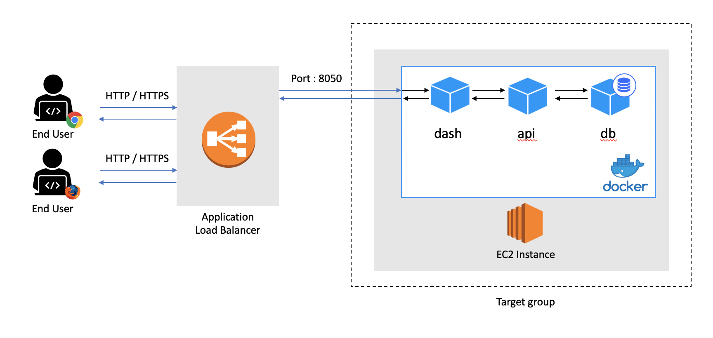
</p>

Here's the workflow:

When a user goes to [reviews.ai2prod.com](http://reviews.ai2prod.com) from his browser, a request is sent to the DNS server which in turn redirects it to a load balancer.
The load balancer redirects its request to an EC2 instance inside a target group.
Finally, when docker-compose receives the request on port 8050, it redirects it to the Dash container.

So how did we build this workflow? Below are the main steps.

**Deploy the app on an EC2 instance**

The very first step to our deployment journey is launching an instance to deploy our app on.

To do this, go to the EC2 page of the [AWS Console](https://console.aws.amazon.com/ec2), and click on the "launch Instance".

You will need to select an AMI. We used Amazon Linux 2, but you can choose any Linux based instance.

<p align="center">
    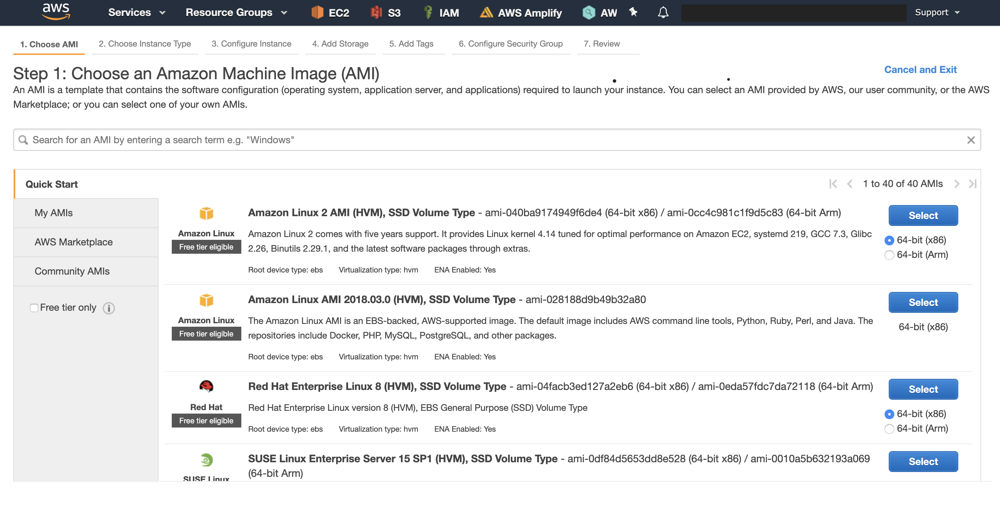
</p>

You will then need to choose an instance type. We went for a t3a.large but you could probably select a smaller one.

You will also need to configure a security group so that you can ssh into your instance, and access the 8050 port on which our dash app runs.
This is done as follows:

<p align="center">
    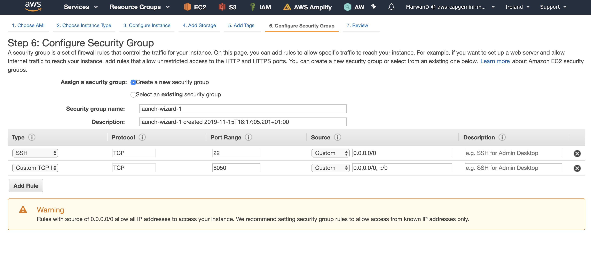
</p>

You can finally launch the instance. If you need more explanations on how to launch an EC2 instance you can read [this tutorial](https://www.guru99.com/creating-amazon-ec2-instance.html).

Now that we have our instance, let's ssh into it:
```
ssh -i path/to/key.pem ec2-user@public-ip-address
```

We can then install docker. Below are the installation instructions for Amazon Linux 2 instances. Please refer to the official Docker installation instructions for other OS.

```
sudo yum update -y
sudo amazon-linux-extras install docker
sudo service docker start
sudo usermod -a -G docker ec2-user
```

⚠️ You will need to log out and log back in. ⚠️

Then install docker compose:

```
sudo curl -L "https://github.com/docker/compose/releases/download/1.24.1/docker-compose-$(uname -s)-$(uname -m)" -o /usr/local/bin/docker-compose
sudo chmod +x /usr/local/bin/docker-compose
```

And test the install

```
$ docker-compose --version
docker-compose version 1.24.1, build 4667896b
```


Then clone the git repository:
```
sudo yum install git
git clone https://github.com/MarwanDebbiche/post-tuto-deployment.git
```

And finally run the app:
```
cd post-tuto-deployment
docker-compose up --build -d
```

Once it's running, you can access the dashboard from the browser by typing the following address:

- http://your-ec2-public-DNS:8050

We could stop here, but we wanted to use a cooler domain name, a subdomain for this app, and an SSL certificate. These are optional configuration steps, but they're recommended if you want a polished product.

**Buy your own domain name**

First, you will need to buy a cool domain name. You can choose any domain registrar, but using AWS [Route53](https://aws.amazon.com/route53) will make things easier as we are deploying the app on AWS.

Go the Route53 page of the AWS console, and click on "Domain registration".

<p align="center">
    
</p>

Then, follow the domain purchase process which is quite straightforward. The hardest step is finding an available domain name that you like.

**Request an SSL certificate using ACM**

Once you have purchased your own domain name on Route53, you can easily request an SSL certificate using [AWS Certificate Manager](https://aws.amazon.com/certificate-manager).

<p align="center">
    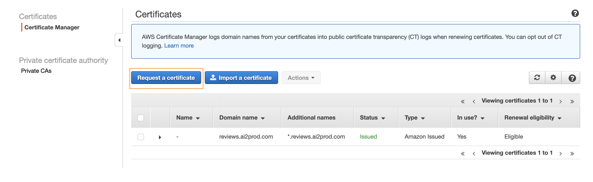
</p>

You will need to enter the list of subdomains that you wish to protect with the certificate (for exemple `mycooldomain.com` and `*.mycooldomain.com`).

Then, if you registered your domain on Route53, the remainder of the process is quite simple:

- Choose DNS Validation
- Confirm
- Then AWS will offer to automatically create a CNAME record in Route53 to validate the certificate.

<p align="center">
    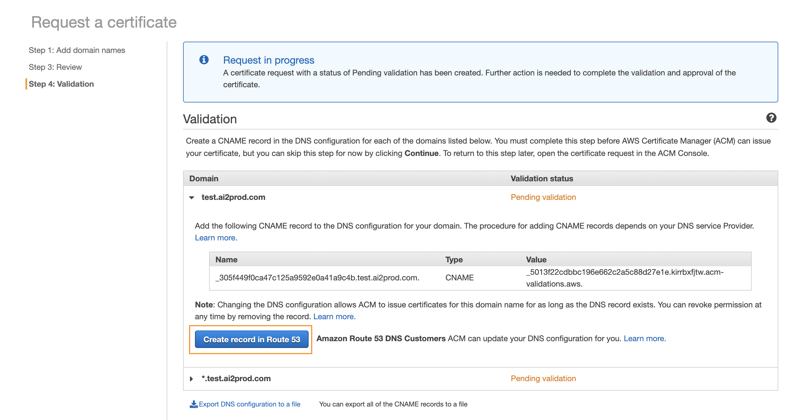
</p>

According to the [documentation](https://docs.aws.amazon.com/acm/latest/userguide/gs-acm-validate-dns.html), it can then take a few hours for the certificate to be issued. Although from our own experience, it usually doesn't take longer than 30 minutes.

**Put the app behind an Application Load Balancer**

Load balancers are, as their names suggest, usually used to balance the load between several instances. However, in our case, we deployed our app to one instance only, so we didn't need any load balancing. In fact, we used an [AWS ALB](https://docs.aws.amazon.com/elasticloadbalancing/latest/application/introduction.html) (Application Load Balancer) as a reverse proxy, to route the traffic from HTTPS and HTTP ports (443 and 80 respectively) to our Dash app port (8050).

To create and configure your Application Load Balancer go to the [Load Balancing tab](https://console.aws.amazon.com/ec2/home#LoadBalancers) of the EC2 page in the AWS console and click on the "Create Load Balancer" button:


<p align="center">
    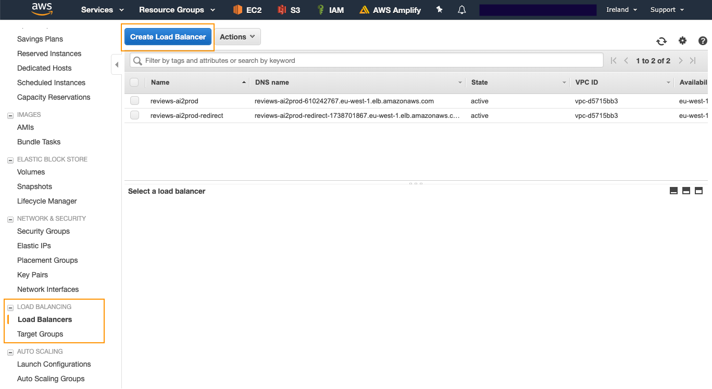
</p>

Then you will need to select the type of load balancer you want. We won't go into too much details here, but for most use-cases you will need an Application Load Balancer.

<p align="center">
    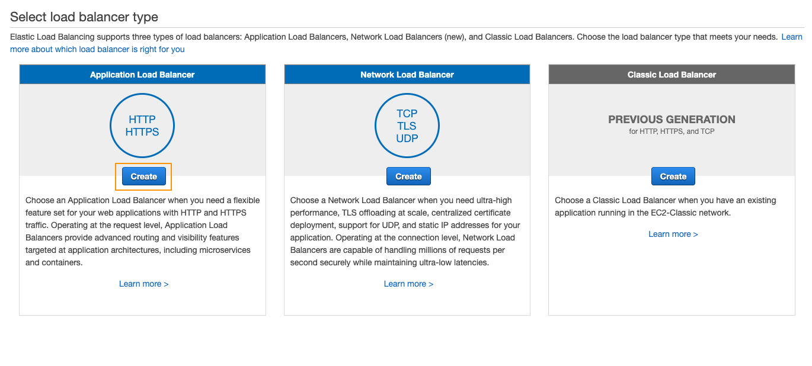
</p>

Then you will have to:
- Give a name the load balancer
- Select the "internet-facing" scheme
- Add listeners for both HTTP and HTTPS
- Select the Availability Zones to enable for your load balancer (if in doubt you can select them all)

As you added an HTTPS listener, you will be asked to select or import a certificate. Select the one you requested using ACM:

<p align="center">
    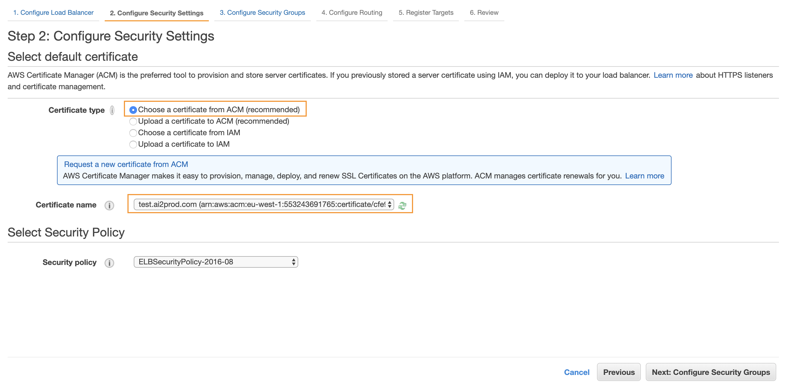
</p>

Then you will need to configure the security groups for your ALB. Create a new security group for your load balancer, with ports 80 (HTTP) and 443 (HTTPS) opened.

Once this is done, remains the final step: creating your target group for your load balancer.

To do that you will need to specify the port on which the traffic from the load balancer should be routed. In our case this is our Dash app's port, 8050:

<p align="center">
    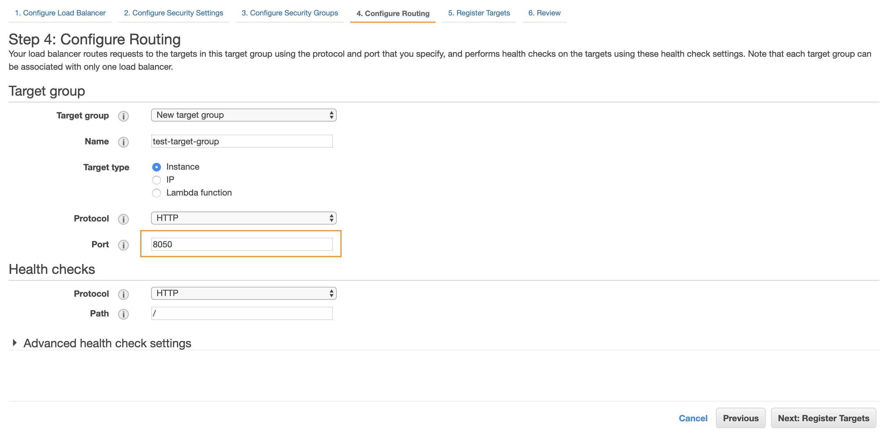
</p>

Now you can add the EC2 instance on which we deployed the app as a registered target for the group:

<p align="center">
    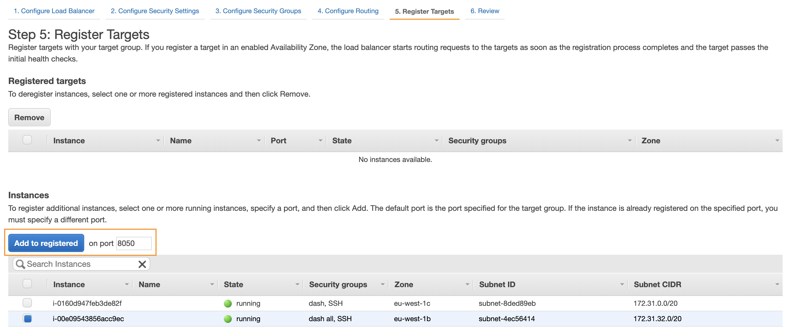
</p>

And, here it is, you can finally create your load balancer.

You can test it by going to your-load-balancer-dns-name-amazonaws.com. you should see your app!

BUT, despite the fact that we have used the certificate issued by ACM, it still says that the connection is not secure!

Don't worry, that's perfectly fine. If you remember correctly, the certificate we requested protects `mycooldomain.com`, not `your-load-balancer-dns-name-amazonaws.com`.

So we need to create a record set in Route53 to map our domain name to our load balancer. We will see how to do that very soon.

But before that, we will already put in place a redirection from HTTP to HTTPS in our load balancer. This will ensure that all the traffic is secured when we will finally use our domain.

To do that, you need to edit the HTTP rule of your Application Load Balancer:

<p align="center">
    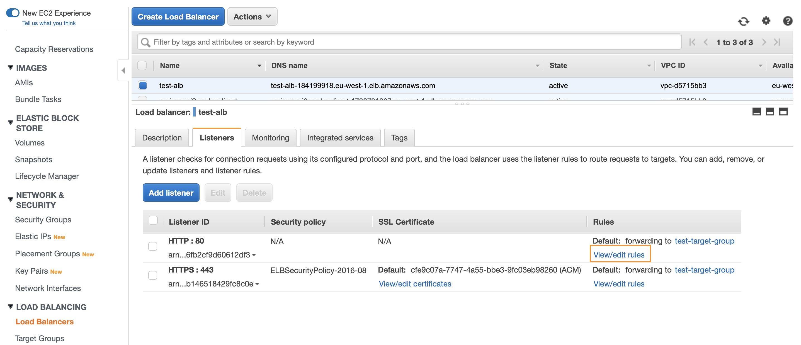
</p>

Click on the pen symbols:

<p align="center">
    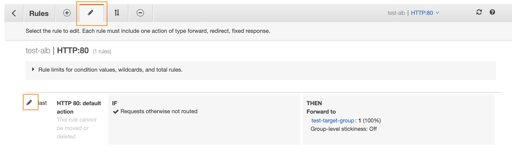
</p>

Delete the previous action (`Forward to`) and then add a new `Redirect to` action:
<p align="center">
    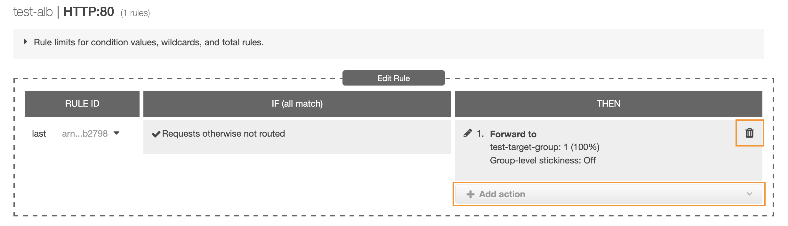
</p>

Finally, select the HTTPS protocol with port 443, and update your rule.

<p align="center">
    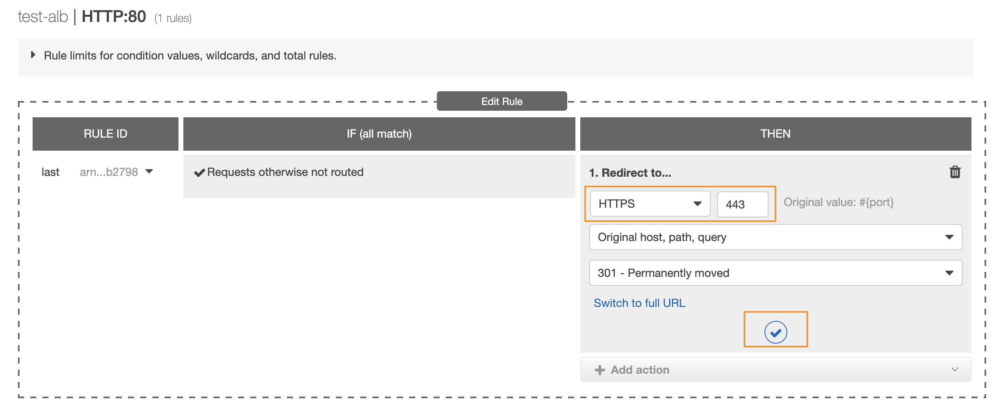
</p>

You should now be automatically redirected to https://your-load-balancer-dns-name-amazonaws.com when accessing http://your-load-balancer-dns-name-amazonaws.com


**Create a record set in Route53**

A Route53 record set is basically a mapping between a domain (or subdomain) and either an IP adress or an AWS asset. In our case, our Application Load Balancer. This record will then be propagated in the [Domain Name System](https://en.wikipedia.org/wiki/Domain_Name_System), so that a user can access our app by typing the URL.

To create a record set go to your hosted zone's page in Route53 and click on the `Create Record Set` button:

<p align="center">
    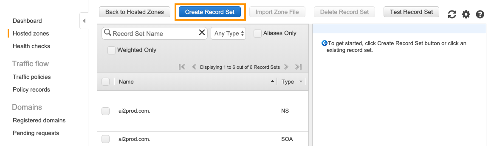
</p>

You will have to:
- Type the subdomain name, or leave it empty if you wish to create a record set for the naked domain
- Select "Yes" for the `Alias` option
- You should be able to select your application load balancer in the `Alias Target` list

<p align="center">
    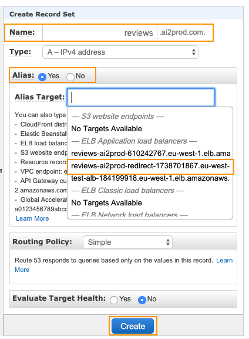
</p>

And you will soon be able to access the app using your custom domain adress (DNS propacation might usually take about an hour).

One last thing that you might want to do is to either redirect traffic from `yourcooldomain.com` to `www.yourcooldomain.com`, or the other way around. We chose to redirect `reviews.ai2prod.com` to [www.reviews.ai2prod.com](http://www.reviews.ai2prod.com)

We won't go into much details here but here is how to do that:
- Create a new application load balancer. It will only be in charge of redirecting to your app's main url so you don't need to register any instance in its target group.
- Modify HTTP and HTTPS listeners to redirect to your app's main url
- Create a record set in Route53 to map the subdomain you wish to redirect your traffic from, to this new ALB

Here is a schema reprensenting how everything works in the end:

<p align="center">
    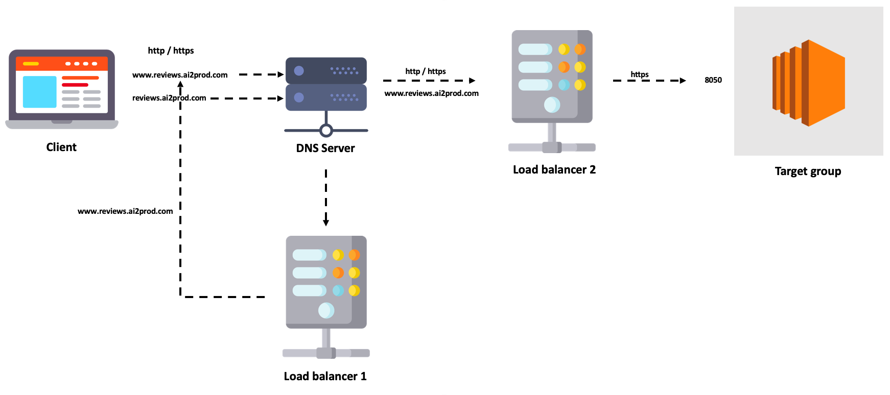
</p>


## 6 - Next steps 🛠

When building this application, we thought of many improvements that we hadn't time to successfully add.

In particular we wanted to:

- Add server-side pagination for Admin Page and `GET /api/reviews` route.
- Protect admin page with authentication.
- Either use [Kubernetes](https://kubernetes.io) or [Amazon ECS](https://aws.amazon.com/ecs) to deploy the app on a cluster of containers, instead of on one single EC2 instance.
- Use continuous deployment with [Travis CI](https://travis-ci.org)
- Use a managed service such as [RDD](https://aws.amazon.com/rds/) for the database

## 7 - Conclusion  👋

Throughout this tutorial you learned how to build a machine learning application from scratch by going through the data collection and scraping, model training, web app development, docker and deployment.

Every block of this app is independently packaged and easily reusable for other similar use cases.

We're aware that many improvements could be added to this project and this is one of the reason we're releasing it.
So if you think of any feature that could be added don't hesitate to fork the repo and create a pull request.
If you're also facing an issue running the app do not hesitate to [report it](https://github.com/MarwanDebbiche/post-tuto-deployment/issues). We'll try to fix the problem as soon as possible.

That's all folks! 🎉 